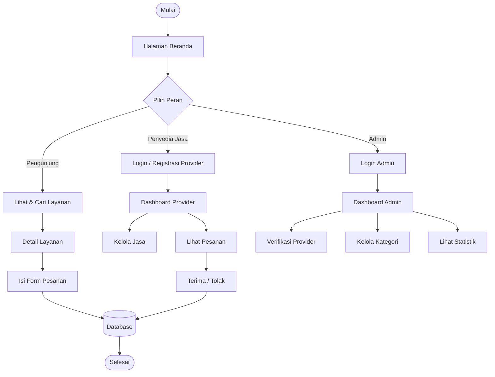
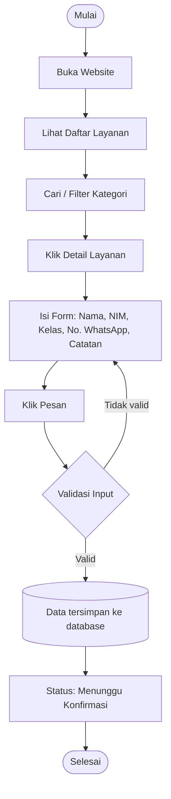
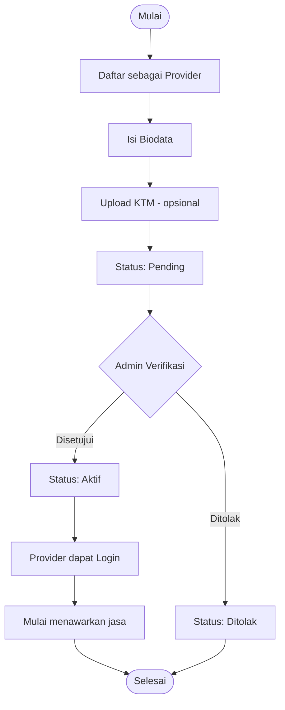
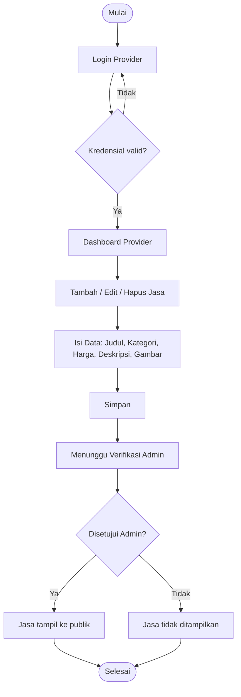
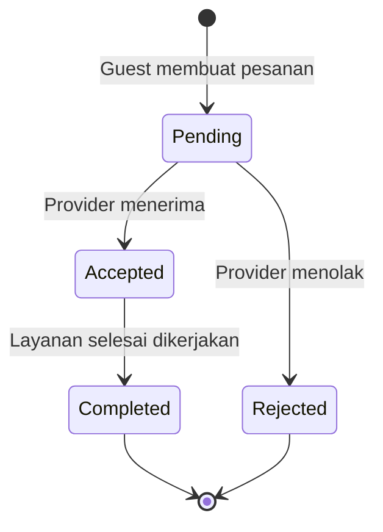
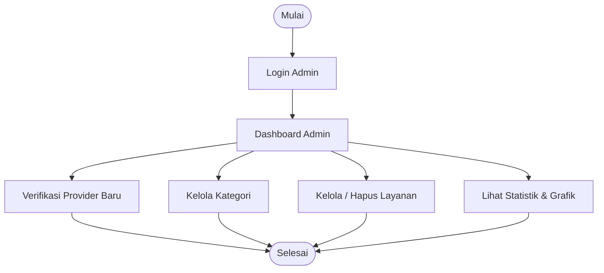
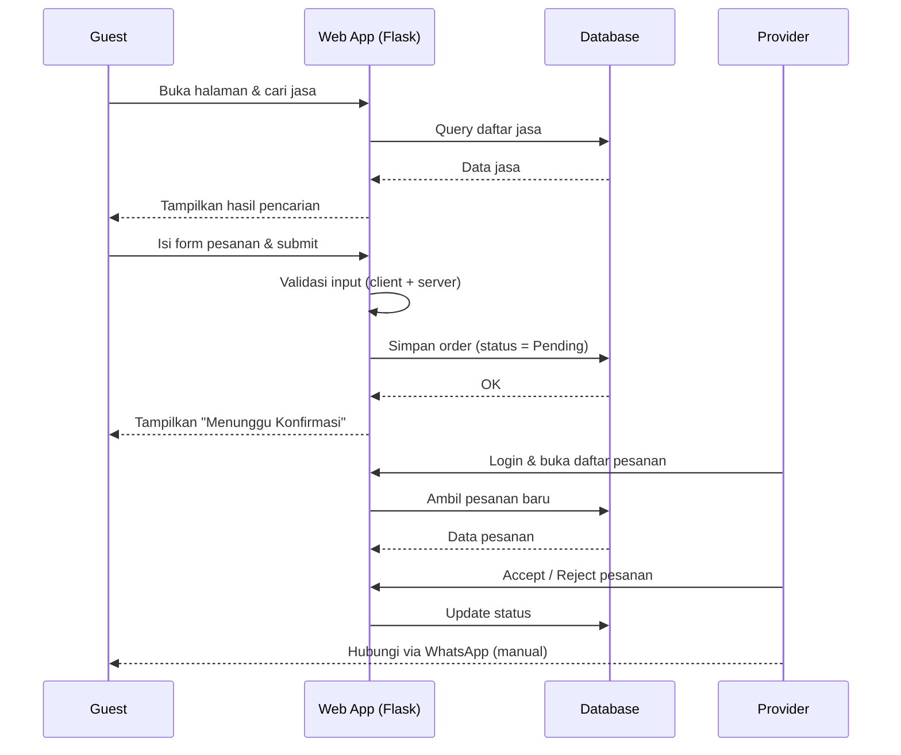

# 🔄 Workflow — CampusHub

Dokumen ini menjabarkan alur kerja sistem CampusHub dalam bentuk diagram, diturunkan dari algoritma dan alur logika di `DESIGN.md`. Diagram-diagram ini bisa langsung dipakai sebagai dasar **BAB III.2 Perancangan Sistem (Flowchart/Diagram Alir)** pada laporan UAS.

> Sintaks Mermaid — otomatis ter-render di GitHub, banyak editor Markdown, dan sebagian besar viewer modern. Untuk laporan, bisa di-screenshot atau diekspor lewat [mermaid.live](https://mermaid.live).

---

## 1. Alur Sistem Secara Umum

## 2. Alur Pengunjung — Melihat hingga Memesan Layanan

*Ref: FR-01, FR-02, FR-03, FR-04 di `PRD.md`*

## 3. Alur Registrasi & Verifikasi Provider

*Ref: FR-05, FR-06, FR-07*

## 4. Alur Provider Mengelola Jasa (CRUD)

*Ref: FR-08*

## 5. Siklus Status Pesanan (Order Lifecycle)

*Ref: FR-09 — status disederhanakan jadi 4 nilai sesuai catatan "Status Order" di `DESIGN.md`.*

## 6. Alur Admin

*Ref: FR-06, FR-10, FR-11, FR-12, FR-13*

## 7. Sequence Diagram — Guest Memesan Jasa (End-to-End)

## 8. Ringkasan Status & Transisi

| Status | Dipicu Oleh | Status Selanjutnya |
|---|---|---|
| Pending | Guest submit form pesanan | Accepted / Rejected |
| Accepted | Provider menerima | Completed |
| Rejected | Provider menolak | *(akhir)* |
| Completed | Provider menandai selesai | *(akhir)* |

> Status **Pending** juga dipakai sebagai basis badge notifikasi "Pesanan Baru" di dashboard Provider (FR-17) — begitu status berubah, badge otomatis berkurang tanpa perlu kolom tambahan di database. Detail implementasi ada di `FOLDER_STRUCTURE.md`.